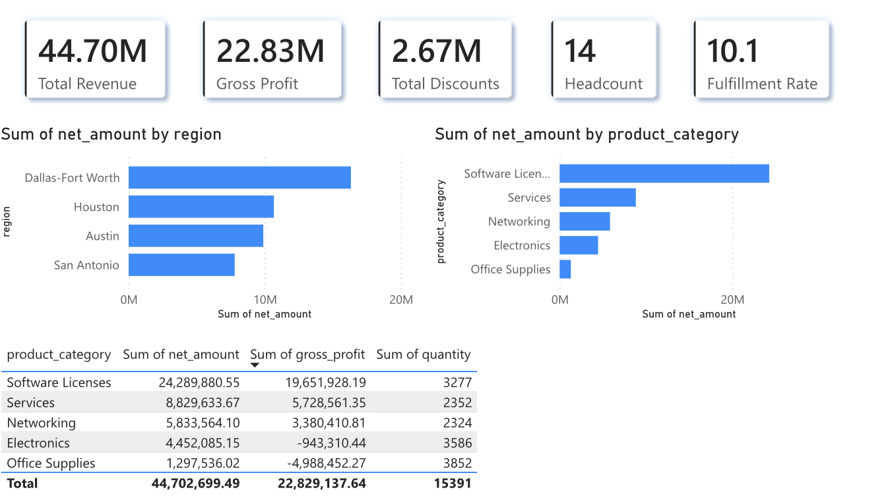
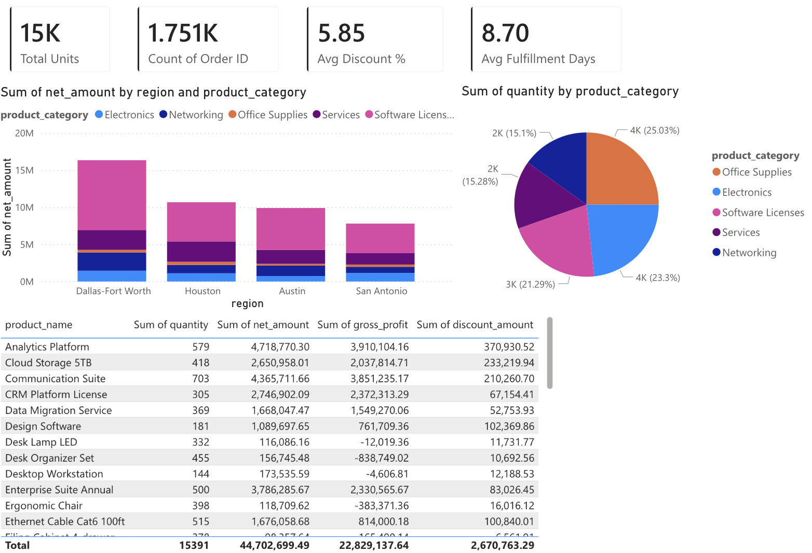
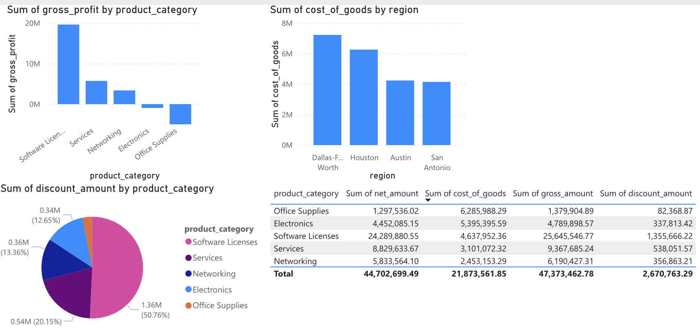
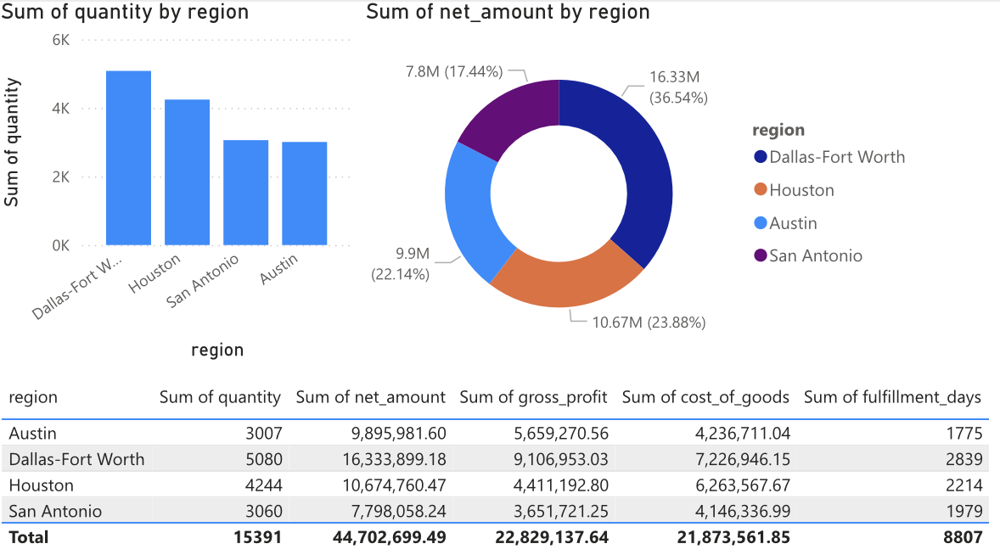
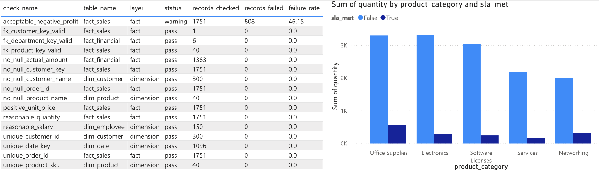

# Enterprise KPI Data Platform

An enterprise analytics platform built for RISE Inc. that ingests raw operational data from 4 source systems, transforms it through a 3-layer dimensional warehouse, runs automated data quality checks, and delivers executive dashboards via React and Power BI.

**Built with:** Python | FastAPI | React | Recharts | PostgreSQL/SQLite | Power BI | DAX

> All data in this project is **simulated sample data** generated for demonstration purposes. No real client, financial, employee, or customer data is used.

---

## Screenshots

### React Dashboards

**Executive Dashboard** — Revenue, margin, orders, fulfillment rate, headcount with trend lines and regional breakdowns


**Sales Analytics** — Performance across regions, products, and customer segments with margin analysis


**Financial Performance** — Budget vs actual variance by department with color-coded indicators


**Workforce Insights** — Headcount trends, turnover rate, salary costs, and department staffing


**Data Quality Monitor** — Pipeline status, 16 automated quality checks with pass/fail/warning tracking


### Power BI Dashboards

**Executive KPI Overview** — Revenue, profit, fulfillment rate with regional and product breakdowns


**Sales Analytics** — Stacked revenue by region/category, pie chart breakdown, detailed product table


**Financial Performance** — Profit by category, cost of goods by region, discount analysis


**Workforce Insights** — Order volume and revenue share by region with fulfillment metrics


**Data Quality** — Quality check results table with SLA compliance by product category


---

## About RISE Inc.

RISE Inc. is a company that delivers innovative digital transformation solutions powered by data, integrated enterprise applications, and mobility across multiple devices to address the enterprise software and IT services needs of multiple industry verticals with specific emphasis on Utilities, Energy, Healthcare, and Manufacturing. With a focus on enterprise, SME, and mid-market segments, RISE partners with tier-one technology and industry verticals to provide optimal digital transformation platforms for clients in a collaborative manner.

## Problem

RISE Inc. had operational data fragmented across 4 siloed systems:

| Source System | Data | Pain Point |
|--------------|------|------------|
| CRM (Salesforce) | Orders, customers, pipeline | No unified revenue view |
| Warehouse Mgmt | Products, inventory, fulfillment | SLA tracking in spreadsheets |
| Finance (QuickBooks) | Revenue, expenses, budgets | Manual budget variance reports |
| HR (ADP) | Headcount, payroll, turnover | No workforce analytics |

Leadership spent **60+ hours per month** manually assembling reports. No single source of truth existed for key metrics like revenue, margins, or employee turnover.

## Solution

An end-to-end data platform that:

1. **Ingests raw data** from 4 source systems with real-world quality issues (duplicates, nulls, inconsistent formats)
2. **Transforms through a 3-layer warehouse** — Staging → Dimensions → Facts (Kimball star schema)
3. **Runs 16 automated data quality checks** — completeness, uniqueness, referential integrity, range validation
4. **Serves 5 React dashboard pages** — Executive, Sales, Finance, Workforce, Data Quality
5. **Exports to Power BI** — 8 denormalized CSV files for 5 Power BI dashboards with DAX measures
6. **Generates executive reports** — Plain-text KPI summaries for leadership review

## Architecture

```
  Source Systems          ETL Pipeline              Data Warehouse           Dashboards
  ┌──────────────┐      ┌──────────────────┐      ┌──────────────────┐     ┌──────────────┐
  │ Salesforce   │      │ Phase 1: Extract │      │ Staging (stg_*)  │     │              │
  │ Warehouse    │─────>│ Phase 2: Dims    │─────>│ Dimensions (dim_*)│────>│ React (5 pg) │
  │ QuickBooks   │      │ Phase 3: Facts   │      │ Facts (fact_*)   │     │ Power BI (5) │
  │ ADP          │      │ Phase 4: Quality │      │ Quality Logs     │     │              │
  └──────────────┘      └──────────────────┘      └──────────────────┘     └──────────────┘
```

## Key Features

| Feature | Details |
|---------|---------|
| **Dimensional Data Model** | 17 tables: 5 staging, 6 dimensions, 4 facts, 2 logging |
| **ETL Pipeline** | 4-phase Python pipeline with orchestrator, timing logs, and run tracking |
| **Data Quality** | 16 automated checks — completeness, uniqueness, referential integrity, range |
| **React Dashboard** | 5 pages with KPI cards, trend charts, bar charts, and sortable tables |
| **Power BI** | 8 CSV exports with 5 DAX measures for executive dashboards |
| **Documentation** | Architecture memo, data lineage, pipeline design, KPI definitions |

## Tech Stack

| Layer | Technology |
|-------|-----------|
| Backend | Python, FastAPI, SQLAlchemy |
| Frontend | React, Recharts |
| Database | SQLite (3-layer dimensional warehouse) |
| ETL Pipeline | Python (4-phase modular pipeline) |
| Analytics | Power BI, DAX |
| Data Export | CSV (8 denormalized export files) |

## DAX Measures (Power BI)

```dax
Gross Margin % =
DIVIDE(SUM(fact_sales[gross_profit]), SUM(fact_sales[net_amount]), 0) * 100

Revenue Growth QoQ =
VAR CurrentQ = SUM(fact_sales[net_amount])
VAR PrevQ = CALCULATE(SUM(fact_sales[net_amount]), DATEADD(dim_date[full_date], -3, MONTH))
RETURN DIVIDE(CurrentQ - PrevQ, PrevQ, 0) * 100

Fulfillment Rate =
DIVIDE(COUNTROWS(FILTER(fact_sales, fact_sales[sla_met] = TRUE)), COUNTROWS(fact_sales), 0) * 100

Employee Turnover Rate =
DIVIDE(SUM(fact_workforce[terminations]), AVERAGE(fact_workforce[active_headcount]), 0) * 100

Budget Variance % =
DIVIDE(SUM(fact_financial[variance_amount]), SUM(fact_financial[budget_amount]), 0) * 100
```

## API Endpoints

| Method | Endpoint | Description |
|--------|----------|-------------|
| GET | `/api/kpis` | Current KPI values (latest month) |
| GET | `/api/kpis/trends` | KPI values over time |
| GET | `/api/sales/summary` | Sales summary with optional filters |
| GET | `/api/sales/by-region` | Revenue breakdown by region |
| GET | `/api/sales/by-product` | Revenue breakdown by product category |
| GET | `/api/sales/by-customer-segment` | Revenue by customer segment |
| GET | `/api/finance/overview` | Financial summary (revenue, expenses, margins) |
| GET | `/api/finance/variance` | Budget vs actual by department |
| GET | `/api/workforce/overview` | Workforce summary (headcount, turnover) |
| GET | `/api/workforce/by-department` | Department-level workforce metrics |
| GET | `/api/quality/latest` | Latest data quality check results |
| GET | `/api/quality/history` | Quality check history across runs |
| GET | `/api/pipeline/status` | Latest pipeline run status |
| POST | `/api/pipeline/run` | Trigger a full pipeline run |

## Project Structure

```
enterprise-kpi-platform/
├── backend/
│   └── app/
│       ├── main.py              # FastAPI app (14 endpoints)
│       ├── models.py            # 17 SQLAlchemy table models
│       ├── schemas.py           # Pydantic response schemas
│       └── database.py          # SQLAlchemy engine setup
├── frontend/
│   └── src/
│       ├── App.js               # Sidebar navigation (5 pages)
│       ├── api.js               # Axios API client
│       └── components/
│           ├── ExecutiveDashboard.js
│           ├── SalesAnalytics.js
│           ├── FinancialPerformance.js
│           ├── WorkforceInsights.js
│           ├── DataQualityMonitor.js
│           ├── KPICard.js
│           ├── TrendChart.js
│           ├── BarChart.js
│           └── DataTable.js
├── scripts/
│   ├── generate_raw_data.py     # Generates messy raw data (5 CSVs)
│   ├── export_for_powerbi.py    # Exports 8 CSVs for Power BI
│   ├── generate_kpi_report.py   # Executive text report
│   └── pipeline/
│       ├── run_pipeline.py      # Orchestrator (runs all 4 phases)
│       ├── extract_to_staging.py    # Phase 1: Raw CSV → staging
│       ├── transform_dimensions.py  # Phase 2: Staging → dimensions
│       ├── transform_facts.py       # Phase 3: Staging + dims → facts
│       └── run_quality_checks.py    # Phase 4: 16 validations
├── data/
│   ├── raw/                     # Source CSVs (generated)
│   └── exports/                 # Power BI CSVs (exported)
├── docs/
│   ├── DATA_ARCHITECTURE_MEMO.md    # Consulting discovery memo
│   ├── DATA_LINEAGE.md              # Source-to-target field mapping
│   ├── ETL_PIPELINE_DESIGN.md       # Pipeline process flow
│   └── KPI_DEFINITIONS.md           # Semantic metrics layer
├── PROJECT_PLAN.md
└── README.md
```

## How to Run

### 1. Backend Setup
```bash
cd enterprise-kpi-platform
python3 -m venv venv
source venv/bin/activate
pip install -r backend/requirements.txt
```

### 2. Generate Data & Run Pipeline
```bash
python scripts/generate_raw_data.py
python scripts/pipeline/run_pipeline.py
```

### 3. Start API Server
```bash
uvicorn backend.app.main:app --reload
# API docs at http://localhost:8000/docs
```

### 4. Start Frontend
```bash
cd frontend
npm install
npm start
# Dashboard at http://localhost:3000
```

### 5. Power BI Export
```bash
python scripts/export_for_powerbi.py
# 8 CSVs saved to data/exports/
```

### 6. Executive Report
```bash
python scripts/generate_kpi_report.py
# Report saved to data/executive_kpi_report.txt
```

## Sample Data

All data is **simulated** using `scripts/generate_raw_data.py`. The generator intentionally includes real-world quality issues to demonstrate ETL pipeline capabilities:

| Source | Records | Intentional Quality Issues |
|--------|---------|---------------------------|
| Orders | ~2,040 | ~2% duplicates, ~3% nulls, 5 date formats, messy region names |
| Customers | ~306 | ~2% duplicates, missing emails/phones |
| Products | 40 | Inconsistent boolean values (Yes/1/TRUE/Active) |
| Financials | ~1,383 | Inconsistent region names, mixed budget flags (Y/Yes/TRUE) |
| Employees | 150 | Mixed date formats, messy region names, On Leave status |
