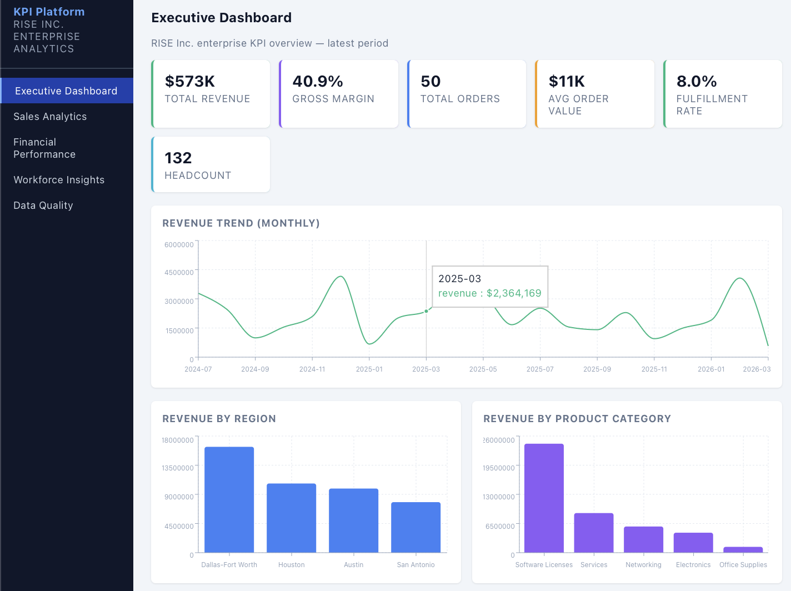
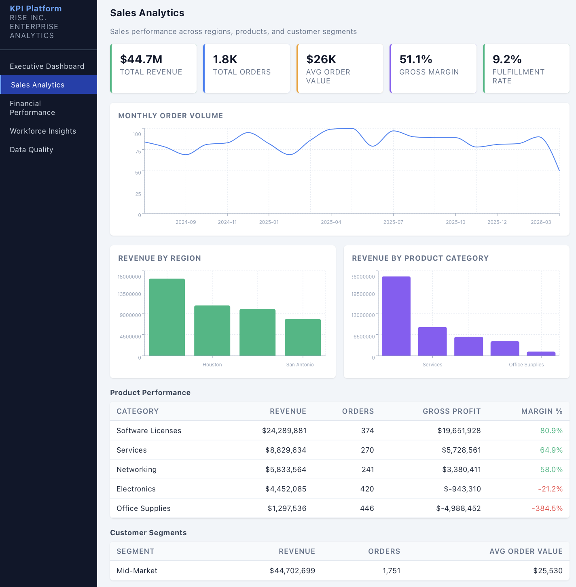
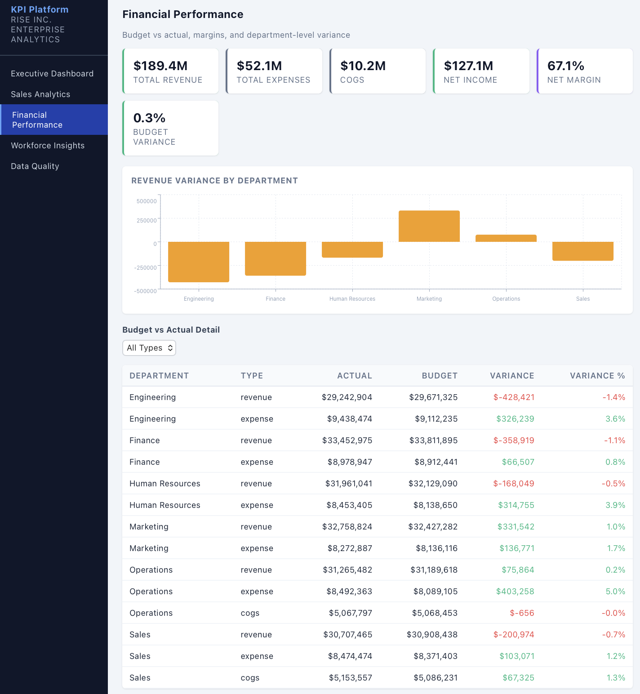
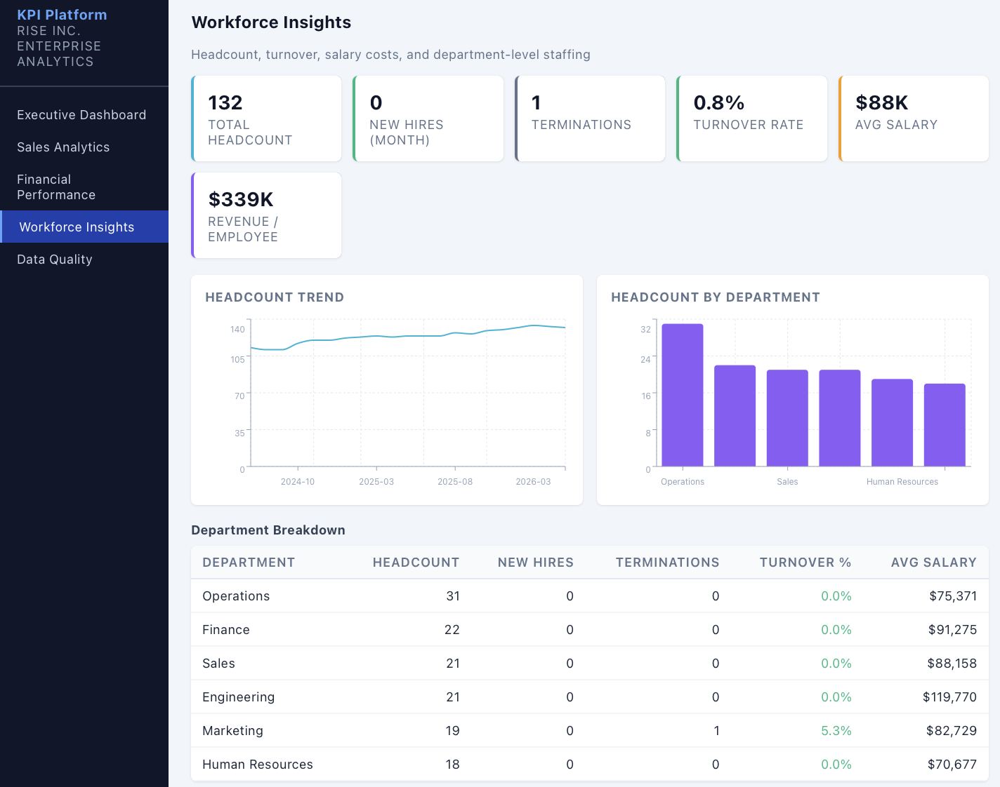
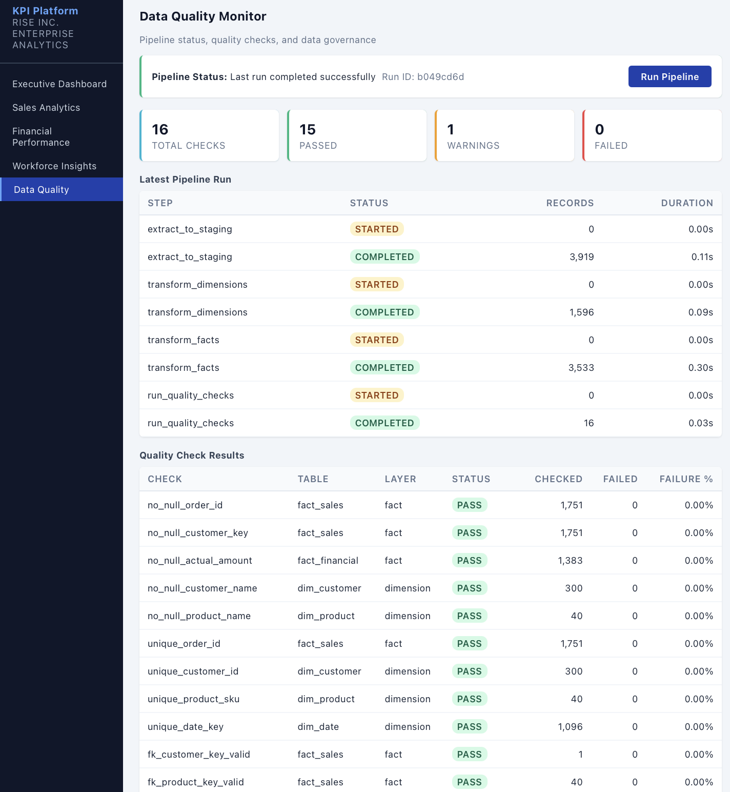

# Enterprise KPI Data Platform

An enterprise analytics platform that ingests raw operational data from 4 source systems, transforms it through a 3-layer dimensional warehouse, runs automated data quality checks, and delivers executive dashboards.

> **Note:** All data in this project is **simulated sample data** generated for demonstration purposes. No real client, financial, employee, or customer data is used.

---

## Dashboard Screenshots

### Executive Dashboard
KPI cards for revenue, margin, orders, fulfillment rate, and headcount. Revenue trend line and breakdowns by region and product category.



### Sales Analytics
Sales performance across regions, products, and customer segments. Product performance table with margin analysis.



### Financial Performance
Budget vs actual comparison, variance by department with color-coded indicators, and expense breakdown.



### Workforce Insights
Headcount trends, turnover rate, salary costs, and department-level staffing breakdown.



### Data Quality Monitor
Pipeline execution status, 16 automated quality checks with pass/fail/warning indicators, and run history.



---

## About RISE Inc.

RISE Inc. is a company that delivers innovative digital transformation solutions powered by data, integrated enterprise applications, and mobility across multiple devices to address the enterprise software and IT services needs of multiple industry verticals with specific emphasis on Utilities, Energy, Healthcare, and Manufacturing. With a focus on enterprise, SME, and mid-market segments, RISE partners with tier-one technology and industry verticals to provide optimal digital transformation platforms for clients in a collaborative manner.

## Problem

RISE Inc. had operational data fragmented across 4 siloed systems:

- **CRM (Salesforce)** — orders, customers, pipeline
- **Warehouse Management** — products, inventory, fulfillment
- **Finance (QuickBooks)** — revenue, expenses, budgets
- **HR (ADP)** — headcount, payroll, turnover

Leadership spent **60+ hours per month** manually assembling reports from spreadsheets. No single source of truth existed for key metrics like revenue, margins, or employee turnover.

## Solution

1. **Ingests raw data** from 4 source systems (CSV exports with real-world quality issues)
2. **Transforms through a 3-layer warehouse** — Staging → Dimensions → Facts (Kimball methodology)
3. **Runs 16 automated data quality checks** — completeness, uniqueness, referential integrity, range validation
4. **Serves a React executive dashboard** — 5 pages covering sales, finance, workforce, and data quality
5. **Exports to Power BI** — 8 CSV files optimized for 5 Power BI dashboards
6. **Generates executive reports** — Plain-text KPI summaries for leadership review

## Architecture

```
    ┌─────────────┐     ┌─────────────┐     ┌─────────────┐
    │  Source CSVs │────>│  Staging    │────>│ Dimensions  │
    │  (4 systems) │     │  (stg_*)    │     │ (dim_*)     │
    └─────────────┘     └─────────────┘     └──────┬──────┘
                                                    │
                         ┌──────────────────────────┘
                         │
                    ┌────┴────┐     ┌─────────────┐
                    │  Facts  │────>│  Dashboard   │
                    │ (fact_*)│     │  (React)     │
                    └────┬────┘     └─────────────┘
                         │
                    ┌────┴────┐     ┌─────────────┐
                    │ Quality │     │  Power BI   │
                    │ Checks  │     │ (CSV export) │
                    └─────────┘     └─────────────┘
```

## Tech Stack

| Layer | Technology |
|-------|-----------|
| Backend | Python, FastAPI, SQLAlchemy |
| Frontend | React, Recharts |
| Database | SQLite (3-layer warehouse) |
| ETL Pipeline | Python scripts (4-phase pipeline) |
| Analytics | Power BI, DAX |
| Data Export | CSV (8 export files) |

## Key Features

- **Dimensional Data Model** — 17 tables: 5 staging, 6 dimensions, 4 facts, 2 logging
- **ETL Pipeline** — Automated 4-phase pipeline with orchestrator and timing logs
- **Data Quality Monitoring** — 16 automated checks with historical tracking
- **Executive Dashboard** — Revenue trends, margin analysis, workforce insights
- **Power BI Integration** — 8 CSV exports with denormalized data for dashboards
- **Consulting Documentation** — Architecture memo, data lineage, KPI definitions, pipeline design

## Project Structure

```
enterprise-kpi-platform/
├── backend/
│   └── app/
│       ├── main.py              # FastAPI (14 endpoints)
│       ├── models.py            # 17 SQLAlchemy models
│       ├── schemas.py           # Pydantic response schemas
│       └── database.py          # SQLAlchemy setup
├── frontend/
│   └── src/
│       ├── App.js               # Sidebar nav (5 pages)
│       ├── api.js               # Axios API client
│       └── components/
│           ├── ExecutiveDashboard.js
│           ├── SalesAnalytics.js
│           ├── FinancialPerformance.js
│           ├── WorkforceInsights.js
│           ├── DataQualityMonitor.js
│           ├── KPICard.js
│           ├── TrendChart.js
│           ├── BarChart.js
│           └── DataTable.js
├── scripts/
│   ├── generate_raw_data.py     # Raw data generator (messy data)
│   ├── export_for_powerbi.py    # CSV exporter (8 files)
│   ├── generate_kpi_report.py   # Executive report generator
│   └── pipeline/
│       ├── run_pipeline.py      # Orchestrator
│       ├── extract_to_staging.py
│       ├── transform_dimensions.py
│       ├── transform_facts.py
│       └── run_quality_checks.py
├── data/
│   ├── raw/                     # Source CSVs (generated)
│   └── exports/                 # Power BI CSVs (exported)
├── docs/
│   ├── DATA_ARCHITECTURE_MEMO.md
│   ├── DATA_LINEAGE.md
│   ├── ETL_PIPELINE_DESIGN.md
│   └── KPI_DEFINITIONS.md
├── PROJECT_PLAN.md
└── README.md
```

## API Endpoints

| Method | Endpoint | Description |
|--------|----------|-------------|
| GET | `/api/kpis` | Current KPI values (latest month) |
| GET | `/api/kpis/trends` | KPI values over time |
| GET | `/api/sales/summary` | Sales summary with optional filters |
| GET | `/api/sales/by-region` | Revenue by region |
| GET | `/api/sales/by-product` | Revenue by product category |
| GET | `/api/sales/by-customer-segment` | Revenue by customer segment |
| GET | `/api/finance/overview` | Financial summary (revenue, expenses, margins) |
| GET | `/api/finance/variance` | Budget vs actual by department |
| GET | `/api/workforce/overview` | Workforce summary (headcount, turnover) |
| GET | `/api/workforce/by-department` | Department-level workforce metrics |
| GET | `/api/quality/latest` | Latest data quality check results |
| GET | `/api/quality/history` | Quality check history across runs |
| GET | `/api/pipeline/status` | Latest pipeline run status |
| POST | `/api/pipeline/run` | Trigger a full pipeline run |

## DAX Measures (Power BI)

```dax
Gross Margin % =
DIVIDE(
    SUM(fact_sales[gross_profit]),
    SUM(fact_sales[net_amount]),
    0
) * 100

Revenue Growth QoQ =
VAR CurrentQ = SUM(fact_sales[net_amount])
VAR PrevQ = CALCULATE(
    SUM(fact_sales[net_amount]),
    DATEADD(dim_date[full_date], -3, MONTH)
)
RETURN DIVIDE(CurrentQ - PrevQ, PrevQ, 0) * 100

Fulfillment Rate =
DIVIDE(
    COUNTROWS(FILTER(fact_sales, fact_sales[sla_met] = TRUE)),
    COUNTROWS(fact_sales),
    0
) * 100

Employee Turnover Rate =
DIVIDE(
    SUM(fact_workforce[terminations]),
    AVERAGE(fact_workforce[active_headcount]),
    0
) * 100

Budget Variance % =
DIVIDE(
    SUM(fact_financial[variance_amount]),
    SUM(fact_financial[budget_amount]),
    0
) * 100
```

## How to Run

### 1. Backend Setup
```bash
cd enterprise-kpi-platform
python3 -m venv venv
source venv/bin/activate
pip install -r backend/requirements.txt
```

### 2. Generate Data & Run Pipeline
```bash
python scripts/generate_raw_data.py
python scripts/pipeline/run_pipeline.py
```

### 3. Start API Server
```bash
uvicorn backend.app.main:app --reload
# API docs at http://localhost:8000/docs
```

### 4. Start Frontend
```bash
cd frontend
npm install
npm start
# Dashboard at http://localhost:3000
```

### 5. Power BI Export
```bash
python scripts/export_for_powerbi.py
# CSVs saved to data/exports/
```

### 6. Executive Report
```bash
python scripts/generate_kpi_report.py
# Report saved to data/executive_kpi_report.txt
```

## Sample Data

All data is **simulated** using `scripts/generate_raw_data.py`. The generator intentionally includes real-world quality issues to demonstrate ETL pipeline capabilities:

| Source | Records | Issues |
|--------|---------|--------|
| Orders | ~2,040 | ~2% duplicates, ~3% null values, 5 date formats |
| Customers | ~306 | ~2% duplicates, missing emails/phones |
| Products | 40 | Inconsistent boolean values (Yes/1/TRUE) |
| Financials | ~1,383 | Inconsistent region names, mixed budget flags |
| Employees | 150 | Mixed date formats, messy region names |
